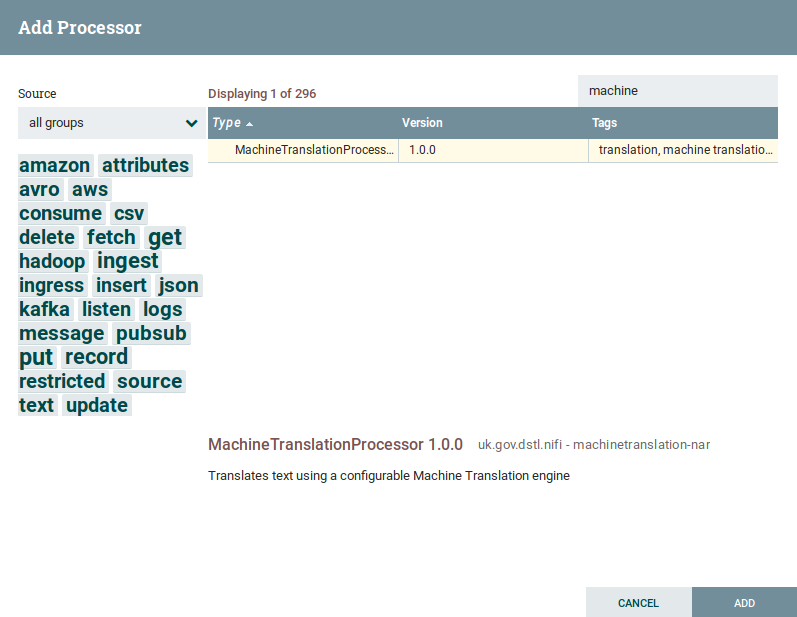
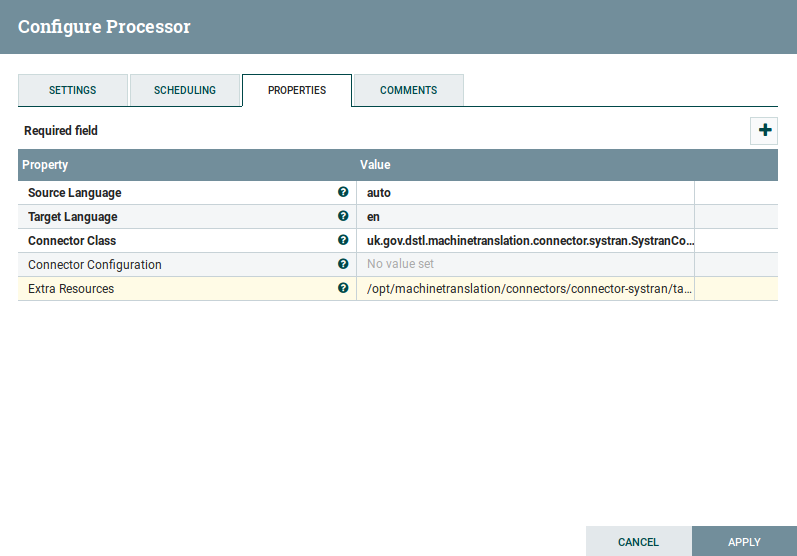
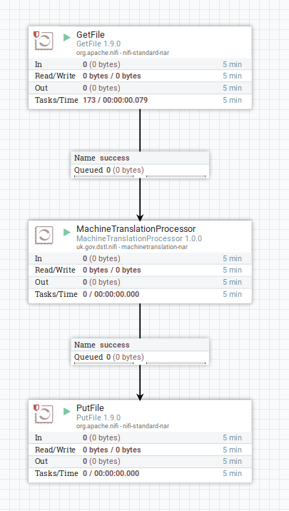

# Machine Translation NiFi Tutorial

This tutorial will walk you through configuring and using the Machine Translation NiFi processor.
For this tutorial, we will be using [Apache Joshua](https://joshua.apache.org), but the steps are similar for all MT tools supported by the Dstl Machine Translation connector API.

## Prerequisites

For the purposes of this tutorial, it is assumed that you already have the following software installed and a basic familiarity with them:

* Apache Joshua
* Apache Maven
* Apache NiFi
* Docker
* Java 8 JDK (newer versions of the JDK may not work due to limitations with Apache NiFi)

We also assume that you have access to the relevant source code.

## Apache Joshua

For instructions on how to set up Apache Joshua, refer to the Joshua documentation, or the [Dstl Joshua Docker image](https://github.com/dstl/docker-images/tree/master/joshua).

## Apache NiFi

[Apache Nifi](https://nifi.apache.org) is a tool for producing and managing data processing pipelines.
Processors perform work on a data as it flows through the pipeline.

### Building and installing the NiFi processor

To build the NiFi processor, run the following command from the `machinetranslation` directory.

    mvn clean package

This will produce the NAR file for your processor in the following location: `machinetranslation-nar/target/machinetranslation-nar-1.0.0.nar`

To install this NAR file, you need to add the following to your `$NIFI_HOME/conf/nifi.properties` file:

    nifi.nar.library.directory.mtlib=/opt/machinetranslation/nifi

Here, you can specify your own directory in place of `/opt/machinetranslation/nifi` (note that it must be an absolute path, and somewhere that NiFi can access). We will refer to this directory as `$NIFI_MT_LIB` in the steps below. You should then copy the NAR file to this directory.

    cp machinetranslation-nar/target/machinetranslation-nar-1.0.0.nar $NIFI_MT_LIB

You now need to restart Apache NiFi to pick up the configuration changes and new component.

    $NIFI_HOME/bin/nifi.sh restart

If you now open [NiFi](http://localhost:8080/nifi/) in your browser, you should find that there is a Machine Translation processor available to you.

### Building the Joshua connector

The NiFi processor above provides a means for NiFi to connect to a machine translation tool via the Dstl Machine Translation Connector API.
However, you need to provide an implementation of this API for your specific tool, Joshua in this case.

To build the Joshua connector, run the following command from the [Joshua Connector](https://github.com/dstl/machinetranslation/tree/master/connectors/connector-joshua) directory (you will need to clone the project separately).

    mvn clean package

### Using the NiFi processor

Start by adding the Machine Translation processor to your workspace. Now look at the configuration, and notice there are a number of options:

* **Source Language** - this is ignored by the Joshua connector, as Joshua is configured to support a single language pair only. Usually though, you would set this to either `auto` (to detect the language) or the language code of the source langage (e.g. `de` for German).
* **Target Language** - this is ignored by the Joshua connector, as Joshua is configured to support a single language pair only. Usually though, this would be the language code of the target language (e.g. `en` for English).
* **Connector Class** - this tells the processor which Connector to use, and should be the fully qualified name of the connector class. In this case, you should set it to `uk.gov.dstl.machinetranslation.connector.joshua.JoshuaConnector`
* **Configuration** - this configures the Connector. In this case, you could leave it blank if the Joshua server is running on the default port, but for completeness you should set it to: `{"server":"http://localhost:5674"}`
* **Extra Resources** - this tells the processor where to find the Connector class, and needs to point to the _shaded_ JAR that you built above. In this case, that's `/opt/machinetranslation/mt-connector-joshua/target/connector-joshua-1.0.0-shaded.jar` (note that your path will likely be different and need amending).

Now, you should be able to hook up the processor to a pipeline and translate some text! Below is an example pipeline that will read files from a folder, translate them and write them back to disk.

