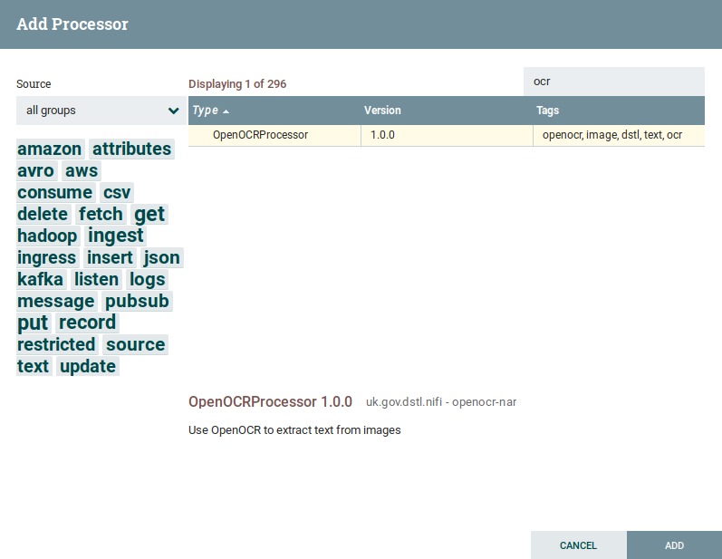
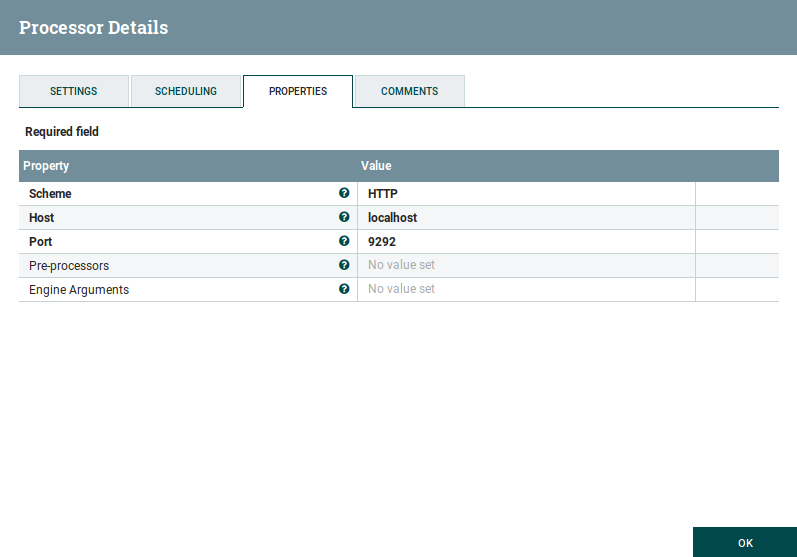
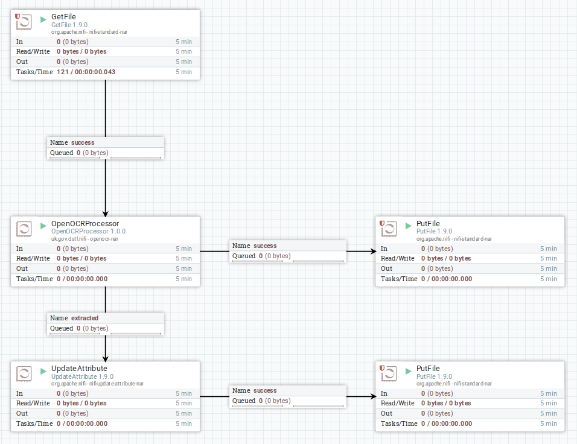

# OpenOCR Tutorial

This tutorial will walk you through setting up OpenOCR and configuring it for use with Apache NiFi.

## Prerequisites

For the purposes of this tutorial, it is assumed that you already have the following software installed and a basic familiarity with them:

* Apache Maven
* Apache NiFi
* Docker
* Docker Compose
* Java 8 JDK (newer versions of the JDK may not work due to limitations with Apache NiFi)

## OpenOCR

[OpenOCR](https://github.com/tleyden/open-ocr) is an open source project, which has it's own detailed documentation for running and configuring. The instructions below should be considered a quickstart guide only.
If you already have an OpenOCR instance running, you can skip this section.

First, you need to get a copy of the OpenOCR repository

    git clone https://github.com/tleyden/open-ocr

Then, use OpenOCR's Docker Compose scripts to start up an instance.

    cd open-ocr/docker-compose
    ./run.sh

You will be asked whether you want to use Tesseract v3 or v4 (v4 considerably outperforms v3 in terms of quality, but is significantly slower), and also whether you want to run it as a daemon or not (choose yes to run it in the background).

Once running, you can test it out by running the following command:

    curl -X POST -H "Content-Type: application/json" -d '{"img_url":"http://bit.ly/ocrimage","engine":"tesseract"}' http://localhost:9292/ocr

If all is well, then you will receive the extracted text back.

## Apache NiFi

[Apache Nifi](https://nifi.apache.org) is a tool for producing and managing data processing pipelines.
Processors perform work on a data as it flows through the pipeline.

### Building and installing the OpenOCR NiFi processor

To build the NiFi processor, run the following command from the `openocr` directory.

    mvn clean package

This will produce the NAR file for your processor in the following location: `openocr/openocr-nar/target/openocr-nar-1.0.0.nar`

To install this NAR file, you first need to add the following to your `$NIFI_HOME/conf/nifi.properties` file:

    nifi.nar.library.directory.openocrlib=/opt/openocr/nifi

Here, you can specify your own directory in place of `/opt/openocr/nifi` (note that it must be an absolute path, and somewhere that NiFi can access).
This directory will be referred to as `$NIFI_OPENOCR_LIB` in the steps below.
You should then copy the NAR file to this directory.

    cp openocr-nar/target/openocr-nar-1.0.0.nar $NIFI_OPENOCR_LIB

You now need to restart Apache NiFi to pick up the configuration changes and new component.

    $NIFI_HOME/bin/nifi.sh restart

If you now open [NiFi](http://localhost:8080/nifi/) in your browser, you should find that there is a OpenOCR processor available to you.

### Using the NiFi Processor

Start by adding the OpenOCR processor to your workspace.
Now look at the configuration and notice there are a number of options.
If you are running the default OpenOCR container, then the default options should be sufficient.

* **Scheme** - Whether the OpenOCR service is connecting over HTTP or HTTPS
* **Host** - The host for the OpenOCR service
* **Port** - The port the OpenOCR service is running on
* **Engine Arguments** - A valid JSON object containing any additional arguments to be passed to the OpenOCR engine (e.g. configuration for Tesseract). This can be left blank.

Now, you should be able to hook up the processor to a pipeline and extract some text! Below is an example pipeline that will read files from a folder, extract them and write the text back to disk (with the original filename), whilst allowing further processing on the original file.

A sample image for testing out the OCR can be found at http://bit.ly/ocrimage

